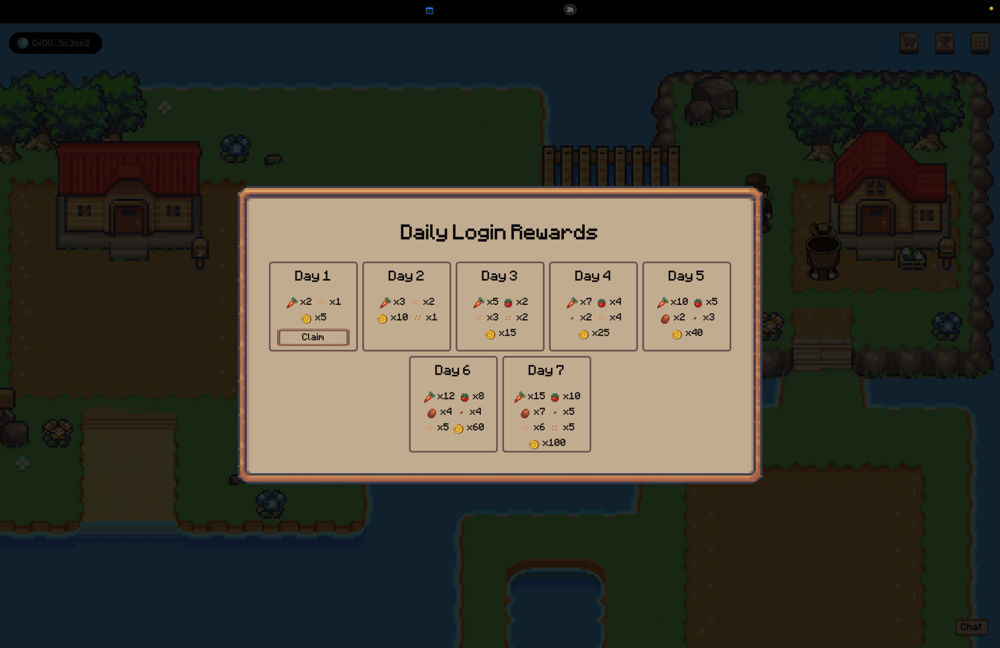

<p align="center">
  
</p>

Harvest Horizons is a 2D Farming game built using Phaser 3 Game Engine. The game has AI Farmer Agents which can execute tasks like planting, harvesting, and trading on your behalf. The farmer also have access to you inventory so they can plan out task using atomic actions.

## How it works 🛠️

To execute any task, you have to prompt the agent in natural language. For example, suppose you have 4 carrot seeds and 3 tomato seeds in your inventory. You can prompt the agent to plant carrots and tomatoes in the following way:

```
Prompt: Plant half of the carrot seeds and all the tomato seeds.
```

then the agent will using a set of predefined atomic actions, to execute the tasks. For example, the agent will use the following atomic actions to execute the task:

- Move to Farm Land
- Plant Carrot Seeds
- Update Inventory to remove carrot seeds
- Plant Tomato Seeds
- Update Inventory to remove tomato seeds

which is reflected by the JSON response:

```json
{
  "message": "Sure, I will plant half of the carrot seeds and all the tomato seeds.",
  "actions": [
    {
      "message": "Moving to Farm Land",
      "action": "move",
      "args": {
        "x": 23,
        "y": 15
      }
    },
    {
      "message": "Planting carrot seeds",
      "action": "plant",
      "args": {
        "seedType": "carrot-seeds",
        "amount": 2
      }
    },
    {
      "message": "Updating inventory to remove carrot seeds",
      "action": "updateInventory",
      "args": [
        {
          "itemType": "carrot-seeds",
          "amount": 2,
          "operation": "remove"
        }
      ]
    },
    {
      "message": "Planting tomato seeds",
      "action": "plant",
      "args": {
        "seedType": "tomato-seeds",
        "amount": 3
      }
    },
    {
      "message": "Updating inventory to remove tomato seeds",
      "action": "updateInventory",
      "args": [
        {
          "itemType": "tomato-seeds",
          "amount": 3,
          "operation": "remove"
        }
      ]
    }
  ]
}
```

Then these atomic actions are executed by the AI agent in a sequential manner, and the game state is updated accordingly.

For Inventory Update, the AI Agents uses tools, in form of a Goat SDK Plugin, which interacts with the on-chain contracts to update the inventory.

### Contract Addresses

```bash
INVENTORY_MANAGER_ADDRESS="0xB42f3232828e044129A937Bb3dfc359Ae6c20b1B"
```

## Screenshots 📸

<table>
  <tr>
    <td valign="top" width="50%">
      <br>
      
    </td>
    <td valign="top" width="50%">
      <br>
      
    </td>
  </tr>
</table>

<table>
  <tr>
    <td valign="top" width="50%">
      <br>
            
    </td>
    <td valign="top" width="50%">
      <br>
            
    </td>
  </tr>
</table>

<table>
  <tr>
    <td valign="top" width="50%">
      <br>
            
    </td>
    <td valign="top" width="50%">
      <br>
            
    </td>
  </tr>
</table>

<table>
  <tr>
    <td valign="top" width="50%">
      <br>
            
    </td>
    <td valign="top" width="50%">
      <br>
            
    </td>
  </tr>
</table>

## 🎥 Demo Video

[](https://www.youtube.com/watch?v=4LavsOdQjrY)

## Get Started 🚀

The following repository is a turborepo and divided into the following:

- **apps/web** - The web application built using Vite.
- **packages/harvest-horizon-goat-plugin** - The Goat SDK plugin to interact with the on-chain contracts.
- **packages/contracts** - Minimal Inventory Manager contract.

First install the dependencies by running the following:

```bash
pnpm install
```

Then fill in the Environment variables in `apps/web/.env.local`

```bash
VITE_REOWN_PROJECT_ID="YOUR_REOWN_PROJECT_ID"
VITE_PRIVATE_KEY="YOUR_PRIVATE_KEY"
VITE_MISTRAL_API_KEY="YOUR_MISTRAL_API_KEY"
```

Then run the following command to start the application:

```bash
pnpm dev
```

---
